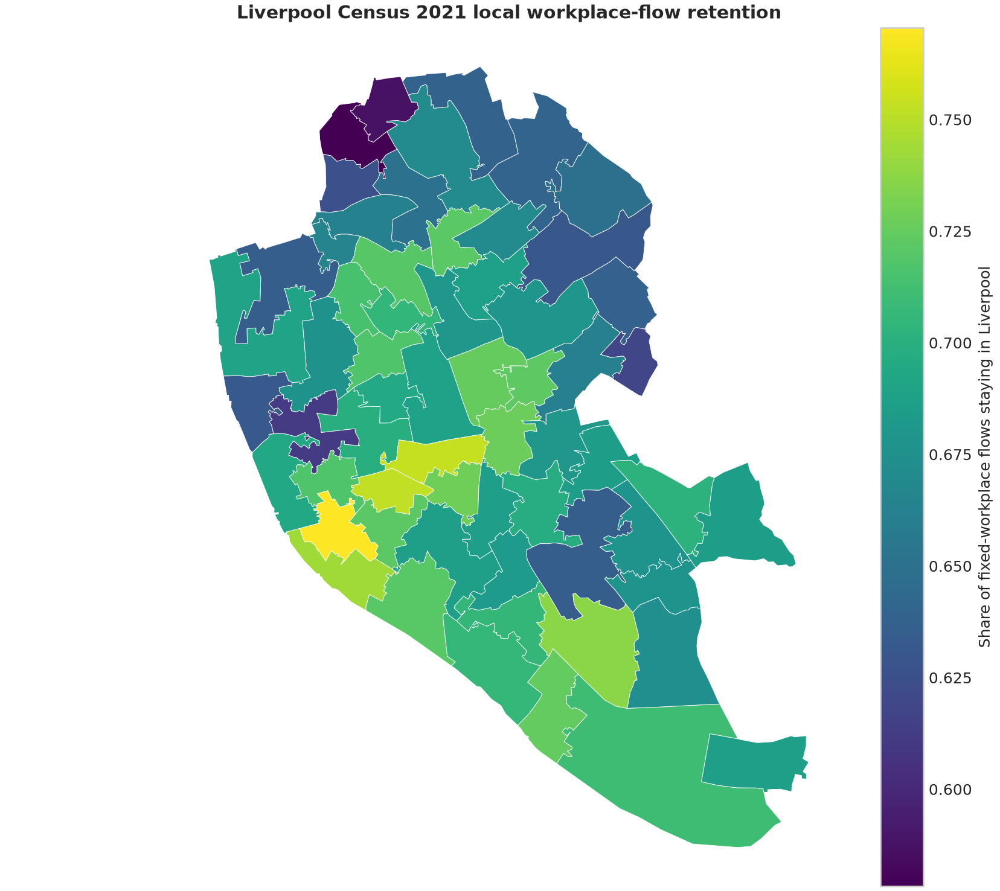

# Ewan Moorcroft Portfolio

I am completing an MSc in Data Science and Artificial Intelligence at the University of Liverpool,
with expected completion in September 2026. I graduated with a BSc in Geography in June 2025.

My main language is Python. I use it for statistical modelling, machine learning and data
engineering, often with spatial or time-dependent data. This portfolio also includes R, SQL, GIS
and Docker where they suit the problem.

*Local workplace-flow retention across Liverpool's 61 MSOAs, calculated from Census 2021 data.*

## Selected projects

### [Liverpool urban accessibility](projects/liverpool-urban-accessibility/)

I used DuckDB, GeoPandas and spatial statistics to study workplace movement within Liverpool.
Of the fixed-workplace flows represented in the data, 68.37% remained within the city. The area
pattern was spatially clustered, with Moran's I of 0.4901. A separate R implementation checks the
main numerical results.

### [FPL next-gameweek forecasting](projects/fpl-forecasting/)

This project predicts a player's points in the following gameweek from information already
available at the forecast date. The ridge model reached an MAE of 1.110 and a Spearman correlation
of 0.717 across ten chronological test windows. It also includes a command-line workflow, DuckDB
storage, a read-only local service and a non-root Docker image.

### [Tree LiDAR benchmark](projects/tree-lidar-benchmark/)

I compared six tree-instance segmentation methods on 49.7 million aligned LiDAR points. The
benchmark handles one-to-one tree matching, class-aware scoring and two result routes per method.
ForestFormer3D achieved the highest development-selected micro F1 at 0.8436.

### [Chest X-ray classification](projects/chest-xray-classification/)

A three-class image-classification project using ResNet18 transfer learning. The grouped-split run
reached macro F1 of 0.8097 on 522 test images. The data pipeline identifies byte-identical images,
keeps each exact copy group in one partition and reports calibration alongside classification metrics.

## Other work

- [Neural chunking](projects/neural-chunking/) labels noun-phrase spans with BiLSTM and Transformer
  encoders. The available BiLSTM result reached token macro F1 of 0.7521.
- [LunarLander Double DQN](projects/lunar-lander-double-dqn/) covers replay memory, online and target
  networks, checkpointing and deterministic evaluation in a reinforcement-learning environment.

Together, the projects demonstrate work with pandas, NumPy, scikit-learn, PyTorch, GeoPandas,
DuckDB, SQL, R, QGIS, pytest, Docker and GitHub Actions. My
[geospatial background](docs/GEOSPATIAL_BACKGROUND.md) gives more context on the link between the
Geography degree and current data-science work. The [reproducibility note](docs/REPRODUCIBILITY.md)
explains the shared approach to environments, data sources and saved outputs.

Each folder under [`projects/`](projects/) is self-contained, with its own README, source code and
results. Software is provided under the [MIT License](LICENSE); data licences are recorded within
the relevant project.
