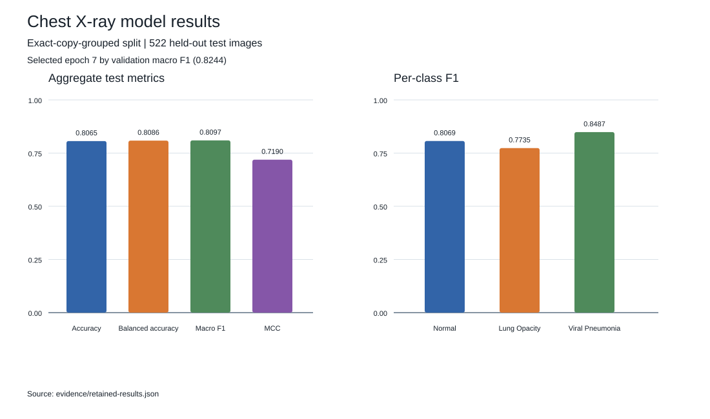
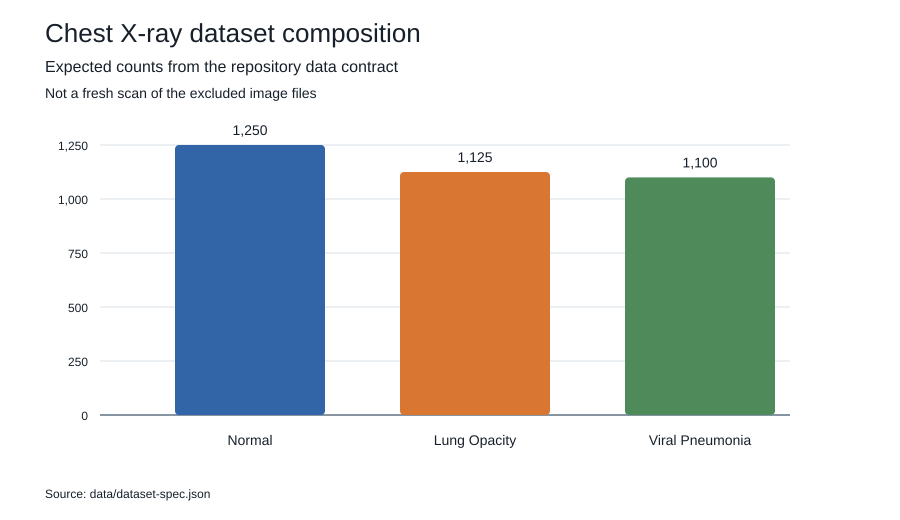

# Chest X-Ray Classification

This project builds a three-class chest X-ray image classifier for **Normal**,
**Lung Opacity** and **Viral Pneumonia**. It uses transfer learning with
ResNet18, a validation-based checkpoint selection step and a held-out test
evaluation. Alongside the model, the repository contains the data checks and
split controls needed to make training and evaluation auditable.

The source is the public [Chest X-Ray dataset on Mendeley Data](https://data.mendeley.com/datasets/p5rm59k7ph/1),
version 1, containing 3,475 labelled images. It is the three-class collection
described by the dataset contract in [`data/dataset-spec.json`](data/dataset-spec.json).

## Results

These numbers came from the earlier run and were not reproduced here. That run
used the older image-level split; a later audit identified five exact duplicate
pairs, and patient identifiers were unavailable. The current pipeline uses a
grouped split, so a new run is needed before claiming current model performance.

| Result | Value |
| --- | ---: |
| Selected model | ResNet18 fine-tuning with dropout |
| Validation macro F1 | 0.9512 |
| Test images | 522 |
| Test accuracy | 0.9368 |
| Test balanced accuracy | 0.9376 |
| Test macro F1 | 0.9381 |
| Test Matthews correlation coefficient | 0.9051 |

The values are retained for provenance in [`evidence/retained-results.json`](evidence/retained-results.json).



The [project walkthrough](notebooks/chest_xray_walkthrough.ipynb) opens the
committed evidence, shows the class balance and duplicate audit, and connects
each part of the analysis to the code that implements it. Exact values are also
available as simple tables in [`results/`](results/).

## Skills demonstrated in the code

| Skill | Main evidence |
| --- | --- |
| Dataset contracts and provenance | [`data/dataset-spec.json`](data/dataset-spec.json), [`spec.py`](src/chest_xray_benchmark/spec.py) |
| Image inventory and integrity checks | [`manifest.py`](src/chest_xray_benchmark/manifest.py) |
| Leakage-aware, deterministic splitting | [`splitting.py`](src/chest_xray_benchmark/splitting.py) |
| Transfer learning and reproducible training | [`modeling.py`](src/chest_xray_benchmark/modeling.py), [`training.py`](src/chest_xray_benchmark/training.py), [`default.toml`](configs/default.toml) |
| Evaluation and calibration metrics | [`evaluation.py`](src/chest_xray_benchmark/evaluation.py), [`metrics.py`](src/chest_xray_benchmark/metrics.py) |
| Command-line workflow | [`cli.py`](src/chest_xray_benchmark/cli.py) |

## Why the split needs an integrity check

If the same image file appears in both training and held-out test data, the
model can see an example during fitting and appear to perform well when it is
tested on that same example. This is data leakage, not evidence of reliable
generalisation. The pipeline computes a SHA-256 digest for every image and
keeps exact copies in one partition. It rechecks each file before a data loader
is built. Difference hashes can flag visually similar pairs for review, but
they do not prove that two images came from the same patient. Patient-level
independence cannot be established because patient identifiers are not supplied
with the public collection.

## Dataset

The expected source is **Chest X-Ray**, version 1, DOI
[`10.17632/p5rm59k7ph.1`](https://doi.org/10.17632/p5rm59k7ph.1), licensed
under CC BY 4.0. The expected class counts are:

| Class | Images |
| --- | ---: |
| Normal | 1,250 |
| Lung Opacity | 1,125 |
| Viral Pneumonia | 1,100 |
| **Total** | **3,475** |



Images are deliberately excluded from this repository. See
[`data/README.md`](data/README.md) for acquisition and attribution details.

## Reproducible workflow

Create an environment with Python 3.11 or newer:

```bash
python -m venv .venv
source .venv/bin/activate
python -m pip install -e ".[train,test]"
```

After downloading the public data and extracting it into `data/raw`, build and
verify the image manifest:

```bash
cxr-benchmark verify \
  --data-root data/raw \
  --spec data/dataset-spec.json \
  --manifest-out data/derived/image-manifest.csv \
  --report-out data/derived/verification-report.json \
  --strict

cxr-benchmark split \
  --manifest data/derived/image-manifest.csv \
  --output data/derived/splits.csv \
  --summary-out data/derived/split-summary.json \
  --seed 534
```

Train with the settings in [`configs/default.toml`](configs/default.toml),
then evaluate the selected checkpoint explicitly on the test partition:

```bash
cxr-benchmark train \
  --data-root data/raw \
  --splits data/derived/splits.csv \
  --config configs/default.toml \
  --output-dir outputs/resnet18

cxr-benchmark evaluate \
  --data-root data/raw \
  --splits data/derived/splits.csv \
  --checkpoint outputs/resnet18/best-state-dict.pt \
  --run-metadata outputs/resnet18/run-metadata.json \
  --output outputs/resnet18/test-metrics.json
```

The default model uses ImageNet initialisation, dropout and a new three-class
output layer. Small rotations are used for training; horizontal flips are
excluded because they can reverse laterality markers. The validation partition
selects the checkpoint by macro F1. The test partition is not read by the
training command.

On Apple silicon, `device = "auto"` selects MPS when available. The default
batch size and worker count are intended to remain practical on an 8 GB
machine. Set `pretrained = false` for an offline run, with the expectation
that its results will differ from the ImageNet-initialised run.

## What each run records

Evaluation writes accuracy, balanced accuracy, macro and per-class
precision, recall and F1, Matthews correlation coefficient, multiclass log
loss, Brier score, expected calibration error and a confusion matrix. Outputs
also retain the split digest, selected checkpoint digest, label order, seed and
run settings so that a result can be tied back to the exact inputs used.

## Checks and implementation detail

Run the focused test suite with:

```bash
python -m pytest
```

The tests cover deterministic exact-identity grouping and splitting,
non-transitive visual-review candidates, cross-partition exact-copy guards,
tampered split and source-image rejection, checkpoint binding, source-spec
parsing, manifest round trips and a synthetic CPU smoke test over the optional
training stack.

The verifier records image dimensions, colour mode, embedded metadata, byte
size, SHA-256 and a difference hash. Exact grouping uses cryptographic identity
only. Perceptual candidates are reported for direct manual review and are not
merged automatically or treated as patient identity. Directory aliases and
symlink targets must remain inside the declared data root.

## Safety and limitations

This is a research benchmark, not a medical device. It must not be used for
diagnosis, treatment, triage or patient-facing decisions. The class labels come
from the source collection and have not been independently reviewed here.

- Patient identifiers and acquisition-site metadata are unavailable.
- Difference hashing is a review heuristic, not proof of shared origin.
- The collection is small and may contain source-specific shortcuts.
- No external population has been evaluated.
- Probability calibration and uncertainty need review on independent data.
