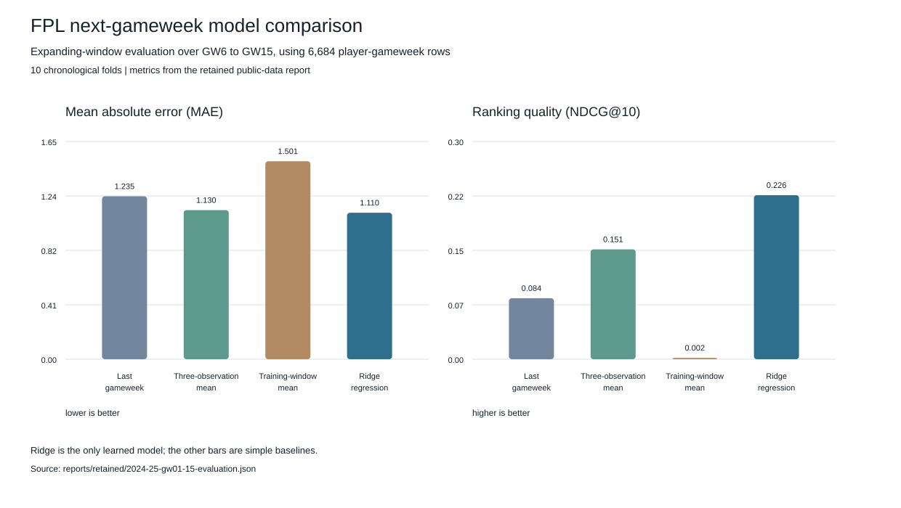

# FPL Next-Gameweek Forecasting

This project forecasts a Fantasy Premier League player's points in the following gameweek from completed gameweek snapshots. It is a compact tabular modelling exercise with the timing constraints that make sports data easy to mishandle. On the public 2024-25 evaluation window, ridge regression had the lowest point error of four candidates: **1.110 MAE**, **2.019 RMSE**, and **0.717 Spearman correlation** across ten gameweeks.

[Open the walkthrough notebook](notebooks/fpl_forecasting_walkthrough.ipynb) or [view the visual overview](demo/index.html).

## Results

The comparison uses gameweeks 1 to 15 from the completed 2024-25 season at source revision [`a59a43a`](https://github.com/vaastav/Fantasy-Premier-League/tree/a59a43a8343d960a58cbe7a1f9fba2d2ce431856/data/2024-25/gws). Each fold trains on earlier target gameweeks and scores the following one. The first scored gameweek is GW6; the final is GW15. There are 6,684 player-gameweek rows across ten folds.

The window stops at GW15 because adjacent-player coverage falls to 0.8987 between GW15 and GW16, below the 0.90 threshold set in advance.



| Candidate | MAE | RMSE | R² | Spearman | NDCG@10 | Top-10 overlap |
|---|---:|---:|---:|---:|---:|---:|
| Last gameweek | 1.235 | 2.673 | -0.274 | 0.655 | 0.084 | 0.090 |
| Three-observation mean | 1.130 | 2.232 | 0.111 | 0.692 | 0.151 | 0.110 |
| Training-window mean | 1.501 | 2.368 | -0.000 | 0.000 | 0.002 | 0.020 |
| Ridge regression | **1.110** | **2.019** | **0.273** | **0.717** | **0.226** | **0.170** |

The [walkthrough](notebooks/fpl_forecasting_walkthrough.ipynb), [comparison table](results/model-comparison.csv), [full metrics record](reports/retained/2024-25-gw01-15-evaluation.json), and [source manifest](reports/retained/2024-25-gw01-15-source-manifest.json) provide the supporting evidence. This is an evaluation on a defined part of one season, not a live deployment or a whole-season forecast. Ridge settings and split rules were set before these figures were produced.

## From snapshots to forecasts

The pipeline accepts one season-tagged JSON snapshot per completed gameweek and checks sequence, coverage, and shape before any modelling begins. It then builds player form and season-to-date features using information available at gameweek `t`, pairing them with points from gameweek `t+1`. Recent-form baselines and ridge regression are compared in forward-moving folds.

That timing matters: a player's next-gameweek points never enter the features used to forecast them. The [data contract](docs/data-contract.md) describes the accepted snapshot format, and the [methodology](docs/methodology.md) defines the folds and metrics. Portable JSON artifacts, verified DuckDB batches, and a model-bound read-only API are included for local use.

## Main implementation

| Area | Where to look | What it shows |
|---|---|---|
| Snapshot validation | [data.py](src/fpl_forecasting/data.py) | Season, sequence, coverage, and snapshot-shape checks |
| Feature engineering | [features.py](src/fpl_forecasting/features.py) | As-of rolling form and season-to-date player features |
| Chronological comparison | [splits.py](src/fpl_forecasting/splits.py) and [evaluation.py](src/fpl_forecasting/evaluation.py) | Expanding folds, error metrics, and ranking metrics |
| Modelling | [models.py](src/fpl_forecasting/models.py) | Baselines, scaled ridge regression, and portable model artifacts |
| Local operation | [operational.py](src/fpl_forecasting/operational.py), [storage.py](src/fpl_forecasting/storage.py), and [service.py](src/fpl_forecasting/service.py) | Verified batch storage and a model-bound read-only API |

## Try it

Create a deterministic example without downloading data:

```bash
python -m pip install -e '.[test]'
fpl-forecast synthetic --output-dir scratch/gameweeks --season 2025-26 --gameweeks 10 --players 24 --seed 42
fpl-forecast evaluate --gameweek-dir scratch/gameweeks --config config/default.json --report-json reports/generated/metrics.json
```

Run the checks with `python -m pytest -q`, `ruff check .`, and `ruff format --check .`. The [methodology note](docs/methodology.md) explains the evaluation, while the [operations guide](docs/operations.md) covers model artifacts, DuckDB storage, and the local service.

Docker is available for the same isolated workflow:

```bash
docker build -t fpl-forecasting .
docker run --rm fpl-forecasting --help
```

The [Dockerfile](Dockerfile) uses the project CLI as its entry point. Mount an explicit directory containing completed snapshots when running the commands above in a container.

## Boundaries of the result

These figures use public FPL records from Vaastav Anand's [Fantasy Premier League repository](https://github.com/vaastav/Fantasy-Premier-League) at pinned revision `a59a43a`. This repository keeps aggregate figures and file-level provenance, not the source CSVs, converted player records, or a fitted model. The upstream repository's [licence](https://github.com/vaastav/Fantasy-Premier-League/blob/a59a43a8343d960a58cbe7a1f9fba2d2ce431856/LICENSE) identifies the underlying data providers.

It forecasts individual next-gameweek points only. It does not optimise a full squad, transfers, captaincy, budget, or bench order, and it does not add fixture schedules, opponent strength, injuries, predicted line-ups, or price history. The synthetic run is for checking the pipeline, not football performance.
