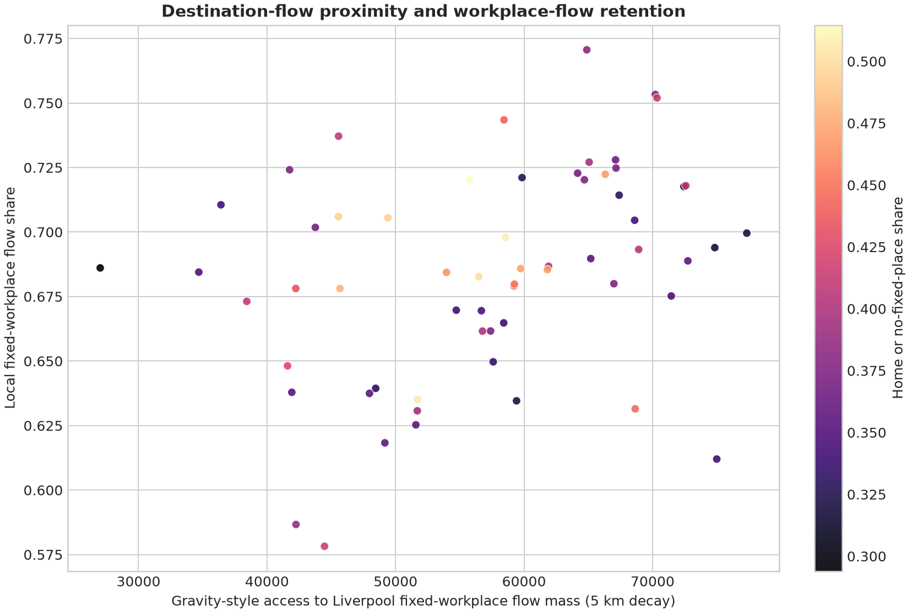

# Liverpool Urban Accessibility

How much recorded workplace movement stayed within Liverpool in the 2021 Census, and did that
pattern vary spatially? I reduced the 197.7 MB national origin-destination table to the city's 61
Middle layer Super Output Areas (MSOAs), joined the flows to official boundaries and analysed the
result in Python and R.


*Share of fixed-workplace flows from each MSOA whose recorded workplace was within Liverpool,
including the origin MSOA. Full details are in the [figure captions](assets/CAPTIONS.md).*

## Results

| Finding | Result |
|---|---:|
| Fixed-workplace flows remaining within Liverpool | 84,567 of 123,689 (68.37%) |
| Spatial clustering of local-retention share | Moran's I = 0.4901, p = 0.0001 |
| Count-model fit on the same 61 areas | NB2 AIC 711.85; Poisson AIC 836.18 |
| Independent Python and R comparison | Maximum coefficient difference `1.05e-12` |

The positive Moran statistic shows that nearby areas tended to have similar local-retention rates.
The lower NB2 AIC is consistent with the overdispersion seen in the Poisson fit. These are
area-level associations, not evidence about individual travel decisions or causes.



*Local-retention share against the 5 km gravity-style workplace accessibility measure. Colour
shows the combined working-at-home or no-fixed-place share.*

ONS combines working mainly at or from home with having no fixed place of work, so that category is
not presented as a home-working rate. The Census was also collected during pandemic disruption,
which matters when interpreting these workplace patterns.

## Analysis and code

The national flow table is queried with DuckDB before any spatial work begins. I then validate the
MSOA codes and geometries, calculate metric distances in British National Grid, build Queen
contiguity weights and estimate Moran's I. Poisson, negative-binomial and binomial specifications
provide different views of the area-level counts. The R script independently refits the Poisson
model and reconstructs the spatial statistic from the same derived inputs.

| What to inspect | File |
|---|---|
| Flow preparation and analysis | [`analysis.py`](src/liverpool_accessibility/analysis.py) |
| Spatial weights and Moran's I | [`spatial.py`](src/liverpool_accessibility/spatial.py) |
| Statistical models | [`modelling.py`](src/liverpool_accessibility/modelling.py) |
| Figure generation | [`reporting.py`](src/liverpool_accessibility/reporting.py) |
| R comparison | [`validate_results.R`](r/validate_results.R) |
| Saved numerical results | [`results.json`](reports/retained/results.json) |

The [methodology](docs/methodology.md) describes the measures and assumptions. Source URLs,
licences and transformations are recorded in [`data/source-spec.json`](data/source-spec.json) and
[`PROVENANCE.md`](PROVENANCE.md).

## Run the project

Python 3.11 or newer and [uv](https://docs.astral.sh/uv/) are required.

```bash
uv sync --locked --extra test
uv run liverpool-access verify --evidence-dir reports/retained
uv run liverpool-access fixture --output-dir reports/generated/fixture
```

The verifier checks the saved file hashes, reconstructs the published aggregates, refits the model
specifications and repeats the fixed-seed spatial permutations. The fixture is fictional and runs
without downloading data.

To repeat the R comparison:

```bash
Rscript r/validate_results.R reports/retained reports/generated/r-validation.json
```

A non-root Docker image is also available:

```bash
docker build -t liverpool-access:local .
docker run --rm liverpool-access:local --help
```

## Scope

The analysis measures recorded workplace flows rather than journey quality, current transport
demand or personal accessibility. MSOA averages hide variation within each area, and centroid-based
distances simplify real routes. The full set of interpretation limits is in
[`docs/limitations.md`](docs/limitations.md).

The current software is available under the repository's evaluation-only licence. Census and
boundary data remain under the Open Government Licence v3.0.
