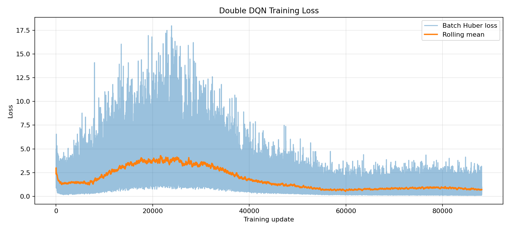
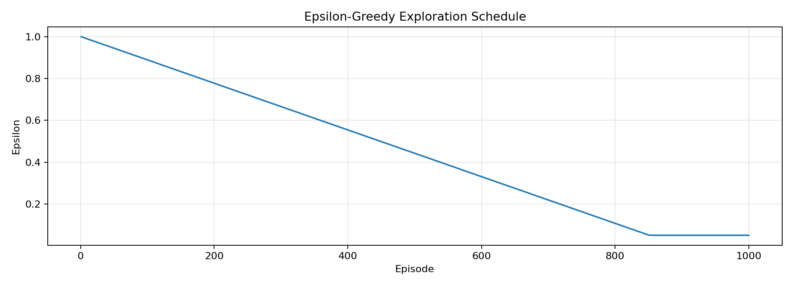

# LunarLander Double DQN

## Results

This reinforcement-learning project trains a Double DQN agent to control the discrete LunarLander environment. One 1,000-episode training run produced a successful greedy policy when evaluated for ten episodes.

| Evaluation | Value |
|---|---:|
| Training seed | 532 |
| Training episodes | 1,000 |
| Greedy evaluation episodes | 10 |
| Mean raw reward | 283.56 +/- 12.07 |
| Reward range | 254.90 to 297.04 |
| Mean episode length | 254.4 steps |
| Centred landing rate | 90% |


The figure and table describe one training seed and ten deterministic evaluation seeds. They show that this run learned a landing policy, not how the method performs across arbitrary seeds or configurations. The checkpoint is not included, so the evaluation file cannot be linked back to exact model bytes.

## How the agent learns

Double DQN uses the online network to select the next action and the target network to estimate its value, reducing the tendency to overestimate action values. Experience is stored in a NumPy-backed circular replay buffer, sampled during training, and used to update the online network. A softly updated target network supplies the bootstrap target.

True terminal transitions are masked from bootstrapping, while time-limit truncations can still contribute a future-value estimate. Reward shaping was used only during training to encourage controlled, centred landings; the table reports raw environment reward. Training can use Apple Metal where PyTorch supports it and otherwise runs on CPU. Separate commands keep the fixed evaluation seeds out of training.


The reward plot covers all 1,000 episodes and includes a 100-episode rolling mean. The loss and exploration traces show the learning signal and epsilon schedule used by the same run.





## Implementation

- [agent.py](src/lunar_dqn/agent.py) implements Double DQN updates, target-network handling, and checkpoints.
- [replay.py](src/lunar_dqn/replay.py) provides the fixed-capacity replay buffer; [network.py](src/lunar_dqn/network.py) defines the value network.
- [training.py](src/lunar_dqn/training.py) runs training and greedy evaluation; [cli.py](src/lunar_dqn/cli.py) exposes the command-line interface.
- [retained_evaluation.json](artifacts/results/retained_evaluation.json) and [SHA256SUMS](artifacts/SHA256SUMS) provide the evaluation metadata and file checksums.

## Reproduce it

Python 3.11 or newer is recommended. On Apple hardware, PyTorch uses Metal when available and otherwise falls back to CPU.

```bash
uv sync --extra test --extra plot
uv run lunar-dqn train --output runs/reference --episodes 1000 --seed 532
uv run lunar-dqn evaluate runs/reference/double_dqn_checkpoint.pt \
  --output runs/reference/evaluation.json --episodes 10 --seed 532
uv run pytest
```

For a quick software smoke run, reduce `--episodes`. A short run checks the pipeline but is not expected to learn a stable landing policy. Verify the supplied files with `shasum -a 256 -c artifacts/SHA256SUMS`.

## What this run does not show

- This evaluation covers one training seed and ten deterministic evaluation seeds, so it is not a multi-seed robustness estimate.
- Reward shaping is specific to centred LunarLander landings and does not make the policy broadly general.
- Exact trajectories can vary with Gymnasium, Box2D, PyTorch, and compute-backend versions.
