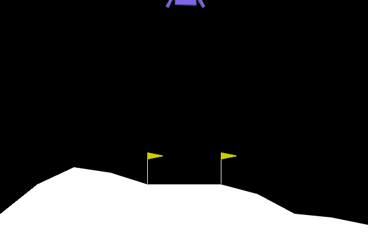
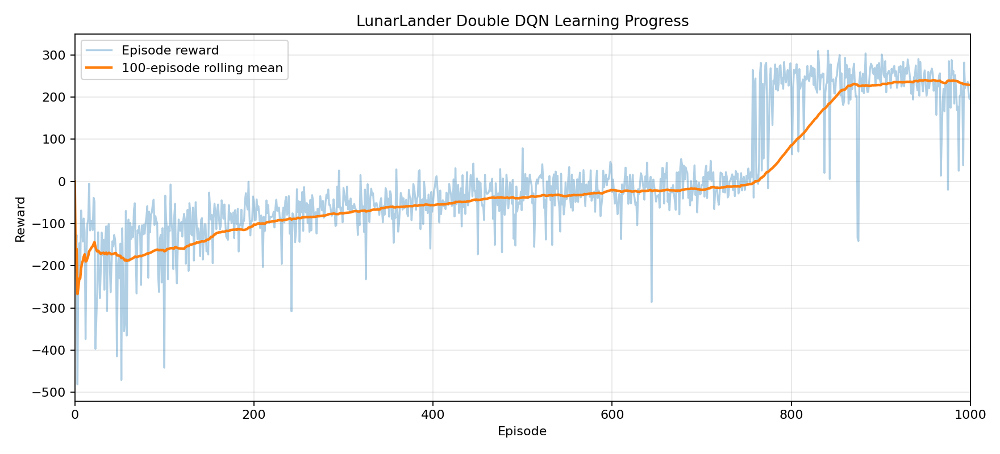

# LunarLander Double DQN

A compact reinforcement-learning system that trains a discrete-control policy with Double DQN,
experience replay, a softly updated target network, gradient clipping, deterministic evaluation,
and portable Apple Metal/CPU device selection.

## Result snapshot

| Retained run | Value |
|---|---:|
| Training episodes | 1,000 |
| Greedy evaluation episodes | 10 |
| Mean raw reward | 283.56 +/- 12.07 |
| Reward range | 254.90 to 297.04 |
| Mean episode length | 254.4 steps |
| Centred landing rate | 90% |

These numbers come from a retained reference run using one training seed. They demonstrate a
successful run, not expected performance across arbitrary seeds. The repository does not include
the checkpoint; training and evaluation can be repeated with the documented configuration.
Fresh evaluations define a centred landing as a true terminal state with both leg-contact flags set
and an absolute horizontal position below the configured centre threshold.



## Engineering design

- Double DQN separates action selection from target-network value estimation.
- A NumPy-backed circular replay buffer avoids per-transition object overhead.
- Terminal transitions are explicitly masked from future-value bootstrapping.
- Training-only reward shaping is configurable and raw environment rewards remain the reported
  performance measure.
- Time-limit truncations remain eligible for value bootstrapping; true terminal states are masked.
- Checkpoints contain weights, optimiser state, configuration, and run metadata and use PyTorch's
  restricted weights-only loading.
- Separate commands prevent training from consuming the fixed evaluation seeds.

The reference run used mild shaping to favour controlled, centred landings. This is an intentional
environment-specific inductive bias, so both shaped learning reward and raw reward are logged
separately.

## Reproduce

Python 3.11 or newer is recommended. On Apple hardware, PyTorch uses the Metal backend when
available; otherwise it falls back to CPU.

```bash
uv sync --extra test --extra plot
uv run lunar-dqn train --output runs/reference --episodes 1000 --seed 532
uv run lunar-dqn evaluate runs/reference/double_dqn_checkpoint.pt \
  --output runs/reference/evaluation.json --episodes 10 --seed 532
uv run pytest
```

For a quick software smoke run, reduce `--episodes`. A short run validates the pipeline but is not
expected to learn a stable landing policy.

## Repository map

```text
src/lunar_dqn/     agent, replay, network, training, and command line
tests/             deterministic unit tests for critical value-learning logic
artifacts/figures/ retained plots and one rendered rollout
artifacts/results/ retained evaluation metrics with scope notes
```

## Retained evidence



The raw episode reward and its 100-episode rolling mean cover all 1,000 episodes. The loss and
exploration traces are also retained in `artifacts/figures/`.

Retained figures and result metadata are pinned in
[`artifacts/SHA256SUMS`](artifacts/SHA256SUMS). Verify them with
`shasum -a 256 -c artifacts/SHA256SUMS`.

## Limitations

- The reference metric covers one training seed and ten deterministic evaluation seeds.
- The fixed evaluation seeds should be used only after configuration choices are frozen.
- Reward shaping improves this specific objective but makes the learned policy less general.
- The presentation rollout was selected from deterministic candidates; it is illustrative and is
  not used as evaluation evidence.
- Gymnasium and Box2D version changes can affect exact trajectories.
- Seeded runs are designed to be repeatable, but exact floating-point results can still vary across
  PyTorch versions and compute backends.

The strongest next improvement would be a multi-seed comparison against DQN and a random-policy
baseline with confidence intervals and equal interaction budgets.
