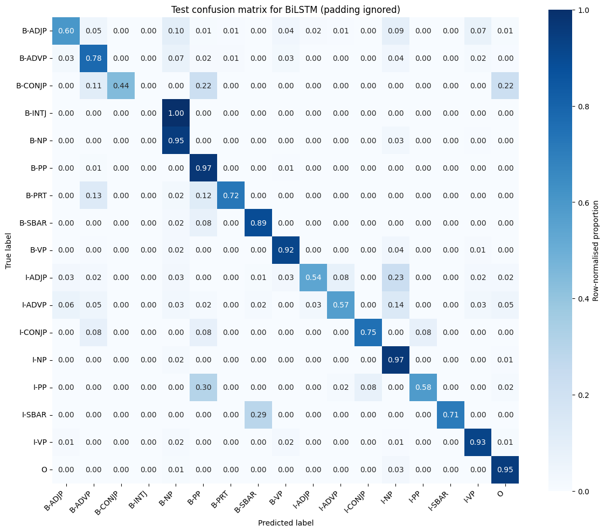

# Neural Chunking with BiLSTM and Transformer Encoders

An end-to-end PyTorch sequence-labelling pipeline for assigning BIO chunk tags to variable-length
sentences. It compares a bidirectional LSTM with a compact Transformer and treats data partitioning,
padding masks, model selection, and exact-span evaluation as first-class concerns.

## Result snapshot

A retained reference run selected the BiLSTM at epoch 16 using validation token macro F1.

| Held-out token metric | Value |
|---|---:|
| Accuracy | 0.9430 |
| Macro F1 | 0.7521 |
| Weighted F1 | 0.9423 |
| Matthews correlation | 0.9288 |

These are token-level results from the retained run. Exact-span predictions were not retained, so a
span F1 is deliberately not inferred. The rebuilt evaluator reports exact-span precision, recall,
and F1 for every new run.

Retained figures and result metadata are pinned in
[`artifacts/SHA256SUMS`](artifacts/SHA256SUMS). Verify them with
`shasum -a 256 -c artifacts/SHA256SUMS`.



## Why the rebuilt pipeline is stronger

- Complete sentences are split by a stable content hash, keeping exact token duplicates together.
- Token and label vocabularies are built only from the training partition.
- Padding is excluded from recurrent state updates, loss, attention, output labels, and every
  reported metric.
- Validation exact-span F1 controls early stopping; the test partition is evaluated once.
- Invalid `I-` transitions are interpreted consistently as new spans during scoring.
- Both neural encoders share the same data, training, and evaluation interfaces.
- Apple Metal acceleration is used when available, with a CPU fallback.

## Data contract

The command line expects a UTF-8 file with one `token BIO-label` pair per line and blank lines between
sentences. Raw text is not redistributed in this repository. A valid input looks like:

```text
New B-NP
York I-NP
works B-VP

```

Use a corpus whose licence permits your intended use and keep it outside version control.

## Run

```bash
uv sync --extra test
uv run neural-chunking train /path/to/chunks.txt --architecture bilstm --output runs/bilstm
uv run neural-chunking train /path/to/chunks.txt --architecture transformer --output runs/transformer

# Freeze the architecture and settings from validation evidence, then evaluate only that checkpoint.
uv run neural-chunking evaluate \
  /path/to/chunks.txt runs/bilstm/chunker_checkpoint.pt \
  --output runs/bilstm/test-results.json
uv run pytest
```

Training outputs include the selected checkpoint, data split counts, epoch history, validation token
metrics, and validation exact-span metrics. The separate evaluation command verifies the input-file
digest before using the test partition. The default settings are sized for an 8 GB Apple laptop.
Fresh macro F1 gives each training-vocabulary label equal weight, including a zero contribution for
an unsupported label. Exact-span scores aggregate matching BIO spans across complete sentences
before calculating precision, recall, and F1.

## Repository map

```text
src/neural_chunking/data.py      parsing, hash splitting, vocabularies, batching
src/neural_chunking/models.py    BiLSTM and Transformer encoders
src/neural_chunking/metrics.py   BIO span extraction and aggregate metrics
src/neural_chunking/training.py  validation selection, explicit test evaluation, persistence
tests/                           split, span, masking, and shape checks
artifacts/                       retained figures and scoped result metadata
```

## Limitations

- The retained run reports token metrics but cannot support a retrospective exact-span score.
- Rare BIO labels have very small support, making macro metrics sensitive to a few examples.
- Content hashing protects exact duplicates, not paraphrases or unknown source-level groups.
- Neither encoder uses pretrained language representations.
- Seeded runs are designed to be repeatable, but exact floating-point results can still vary across
  PyTorch versions and compute backends.

The natural next step is a repeated group-aware comparison against a pretrained encoder while
preserving the same exact-span protocol and compute budget.
