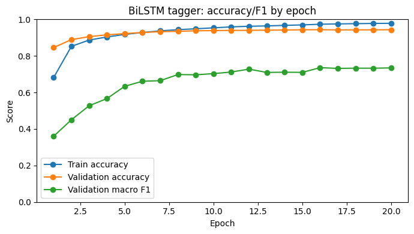
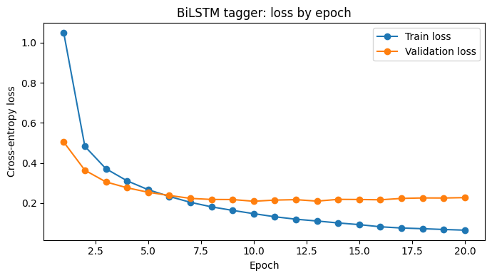

# Neural Chunking

This PyTorch project assigns a BIO label to each token in a sentence. In the
phrase `New York`, for example, `New` may be `B-NP` and `York` `I-NP`. It
provides a BiLSTM and a compact Transformer through the same training and
evaluation interface.

[Open the walkthrough](notebooks/neural_chunking_walkthrough.ipynb) for the
saved metrics, training curves, confusion matrix and direct code links.

## Results

The available evaluation is for the BiLSTM, selected at epoch 16. It covers
31,833 tokens across 1,339 held-out sentences.

| Metric | Score |
| --- | ---: |
| Token accuracy | 0.9430 |
| Token macro F1 | 0.7521 |
| Token weighted F1 | 0.9423 |
| Matthews correlation coefficient | 0.9288 |
| Loss | 0.2158 |

Macro F1 gives rare BIO labels the same weight as common labels, which helps
show whether performance extends beyond the frequent `O` label.






The figures and [saved metrics](artifacts/results/retained_metrics.json) are
integrity-pinned in [`artifacts/SHA256SUMS`](artifacts/SHA256SUMS).

## Design choices

- Sentence boundaries are preserved while reading the data, and exact duplicate
  sentences stay together when the split is made. Vocabularies are built from
  training data only.
- Batches use masks, so padding cannot influence the recurrent state,
  attention, loss or evaluation.
- A checkpoint is selected from validation performance before the held-out
  partition is evaluated. New runs report token metrics and exact BIO-span
  precision, recall and F1.

## Implementation

| Area | Main code |
| --- | --- |
| Input validation, splitting, vocabularies and batching | [`data.py`](src/neural_chunking/data.py) |
| BiLSTM and Transformer encoders | [`models.py`](src/neural_chunking/models.py) |
| BIO decoding and exact-span metrics | [`metrics.py`](src/neural_chunking/metrics.py) |
| Training, checkpoint selection and evaluation | [`training.py`](src/neural_chunking/training.py) |
| Command-line workflow | [`cli.py`](src/neural_chunking/cli.py) |

## Training a new model

Provide a UTF-8 text file with one `token BIO-label` pair per line and blank
lines between sentences. Keep the source corpus outside version control and
use it in line with its licence.

```text
New B-NP
York I-NP
works B-VP

```

```bash
uv sync --extra test
uv run neural-chunking train /path/to/chunks.txt --architecture bilstm --output runs/bilstm
uv run neural-chunking evaluate /path/to/chunks.txt runs/bilstm/chunker_checkpoint.pt --output runs/bilstm/test-results.json
```

Use `--architecture transformer` to train the Transformer. Its positional
encoding supports sentences up to 512 tokens by default.

## What the saved run cannot answer

- The source corpus name, version, hash and licence were not retained, so these
  values are not presented as a dataset-specific benchmark.
- Predictions from the BiLSTM run are unavailable, so exact-span F1 cannot be
  reconstructed.
- Transformer metrics were not retained. The two encoders are therefore not
  presented as an empirical comparison.
