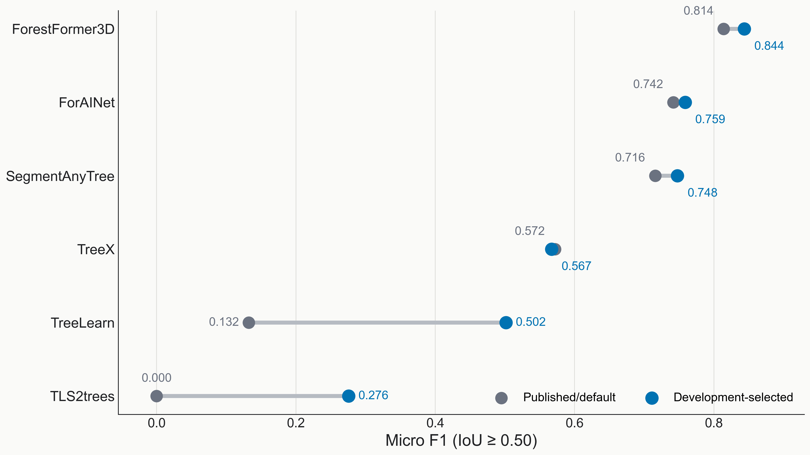
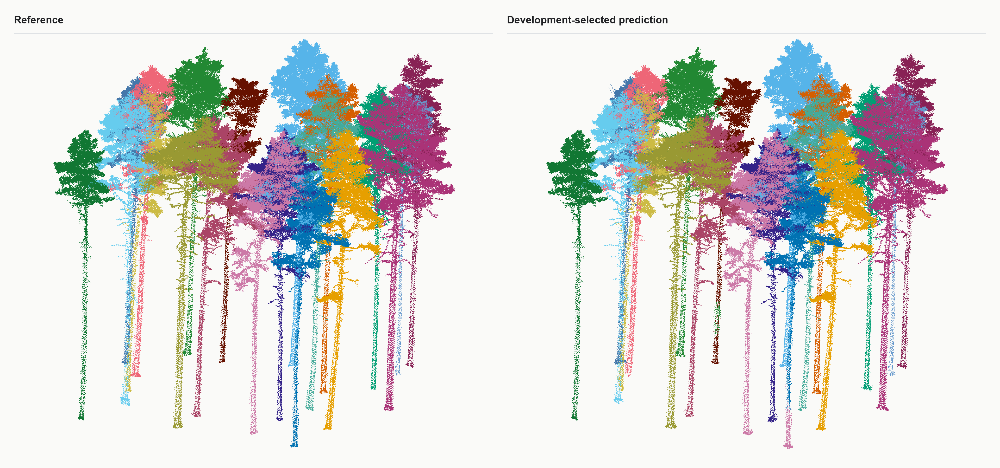

# Tree LiDAR Instance Benchmark

A reproducible evidence pack for evaluating individual-tree instance
segmentation in dense LiDAR point clouds. Six methods are compared on the same
11 held-out plots, covering 49,709,922 source points and 323 reference trees.
The package includes a dependency-free evaluator, an offline verification CLI,
focused tests, retained result tables, and two provenance-tracked visuals.



## Result snapshot

All values below are final/current evidence under
`for_instance_pointwise_v2`. Routes remain separate: `published_default`
captures the published or default setup, while `development_tuned` captures a
checkpoint or parameter set selected using development data only.

| Method | Published/default micro F1 | Development-selected micro F1 |
|---|---:|---:|
| ForestFormer3D | 0.814 | **0.844** |
| ForAINet | 0.742 | 0.759 |
| SegmentAnyTree | 0.716 | 0.748 |
| TreeX | 0.572 | 0.567 |
| TreeLearn | 0.132 | 0.502 |
| TLS2trees | 0.000 | 0.276 |

ForestFormer3D on the development-selected route has the highest micro F1 in
this fixed comparison. Route differences are descriptive rather than
controlled estimates of training benefit because the methods received unequal
development effort. TreeX and TLS2trees use parameter selection rather than
neural fine-tuning.

## Scoring contract

The evaluator implements these fixed rules:

1. Source rows must remain exactly aligned and carry indices `0..n-1`.
2. Reference instances are positive tree IDs on semantic classes 4, 5, or 6.
3. A whole predicted instance is excluded only when class 3 is strictly more
   than 50% of its source-aligned points. Exactly 50% remains eligible.
4. The scoring mask is the union of valid reference-tree points and eligible
   prediction points, so predictions on reference background can reduce IoU.
5. Candidate pairs require IoU `>= 0.50`.
6. Deterministic maximum-cardinality one-to-one matching produces TP, FP, and
   FN counts.
7. Micro precision, recall, and F1 are computed after summing counts across
   plots; mean plot F1 is reported separately.

## Reproduce the checks

Run from this directory with Python 3.11 or newer. No third-party packages are
required.

```bash
PYTHONPATH=src python3 -m tree_lidar_benchmark verify
PYTHONPATH=src python3 -m tree_lidar_benchmark summary
PYTHONPATH=src python3 -m unittest discover -s tests -v
```

An installed wheel carries the same manifest-verified retained evidence, so the commands also work
without a repository checkout:

```bash
python -m pip install tree_lidar_benchmark-1.0.0-py3-none-any.whl
tree-lidar-benchmark verify
tree-lidar-benchmark summary
```

The verification command:

- checks SHA-256 identity for seven retained evidence files;
- validates all 12 method/route identities against the route manifest;
- validates exact coverage of the 11 held-out plots for every route;
- recomputes per-plot precision, recall, and F1 from TP, FP, and FN; and
- rebuilds and compares 1,152 site/overall aggregate values.

## Qualitative result



The held-out `CULS/plot_2_annotated` example uses consistent colours for each
accepted one-to-one match. It contains 20 accepted matches and no unmatched
eligible reference or prediction instances. It was chosen after scoring for
illustration only and is not claimed to represent every plot.

## Project layout

```text
tree-lidar-benchmark/
├── assets/                 Paired metric chart, matched comparison, captions
├── data/                   Plot, site, overall, and route identity evidence
├── src/tree_lidar_benchmark/
│   ├── evaluator.py        Aligned-label scoring and one-to-one matching
│   ├── verification.py     Hash, schema, route, and aggregate checks
│   └── cli.py              `verify` and `summary` commands
├── tests/                  Protocol, aggregation, and content-safety checks
├── PROVENANCE.md           Evidence scope and claim boundaries
└── results_manifest.json   Hashes, protocol, inventory, and headline result
```

The evaluator can score aligned label sequences without the retained raw
predictions. The included tables are sufficient for deterministic aggregate
verification, while raw point clouds and prediction arrays remain outside this
portable project.

## Engineering focus

- point-aligned LiDAR data contracts;
- single-pass contingency aggregation over aligned labels;
- deterministic bipartite matching with adversarial edge-case tests;
- route-aware experiment comparison;
- immutable result provenance through SHA-256 manifests; and
- exact aggregate reconstruction from the most granular retained table.

See [PROVENANCE.md](PROVENANCE.md) for claim boundaries and
[assets/CAPTIONS.md](assets/CAPTIONS.md) for full visual context.
